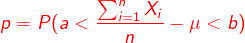
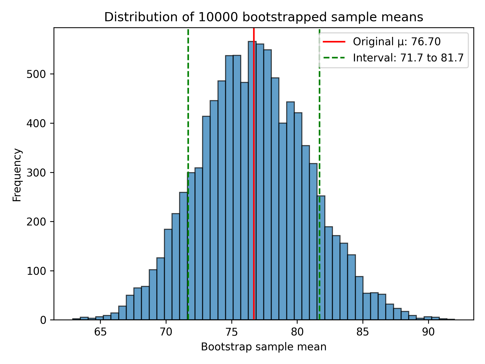

# Estimation of `p` using Bootstrapping

## Introduction
Bootstrapping is a statistical technique that addresses constraints in sample size. By resampling with replacement from an original dataset, it generates numerous simulated 'bootstrap' samples, providing a broader understanding of the potential variations in the data.

## Estimating `p`
The dataset represents 10 independent and identically distributed (i.i.d) random variables from an unknown distribution with an unknown mean $\mu$. 

The objective is to estimate `p`:

Where:

- `n` is the number of observations (10 in this dataset).
- `a` and `b` are constraints set to -5 and 5, respectively.

The arithmetic mean of the 10 observations was used as an estimator for the expected value $\mu$. By bootstrapping 10,000 samples from this dataset and calculating each sample's mean, a distribution of the differences between these sample means and $\mu$ is obtained.

This interval [a + $\mu$, b + $\mu$] is treated as a confidence interval around the estimated mean and the derived value of `p` indicates the proportion of bootstrap sample means that fall within this confidence interval.

## Visualization
A histogram presents the distribution of bootstrapped sample means. The original sample mean is marked with a red vertical line, while the bounds of the confidence interval are indicated by two green dashed lines.

## Key Takeaways
- The estimated mean $\mu$ from the dataset is approximately $76.7$.
- The probability `p = 0.76` which indicates that around 76% of the bootstrapped sample means fall within the confidence interval `[71.7, 81.7]`. This means that the confidence level is 0.76
- The histogram illustrates the spread of bootstrapped sample means relative to this interval.
- Bootstrapping assumes the original dataset accurately represents the broader population. Biases in the original data may be propagated through the bootstrapped samples.
- Variability between script executions is expected due to the inherent randomness in bootstrap sampling.
