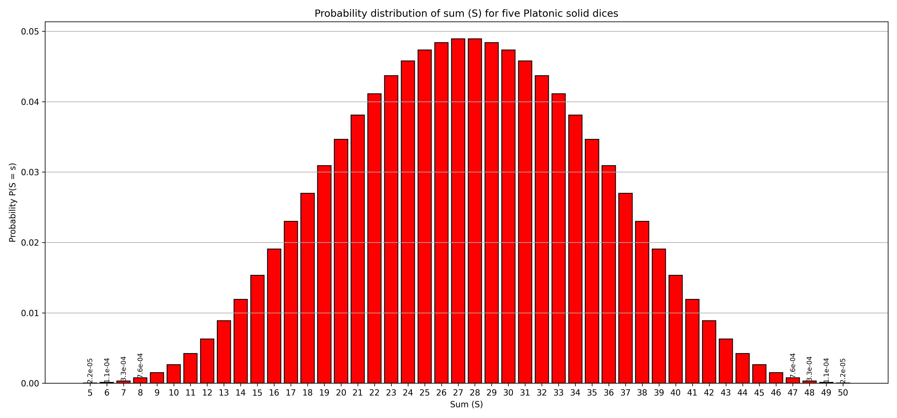
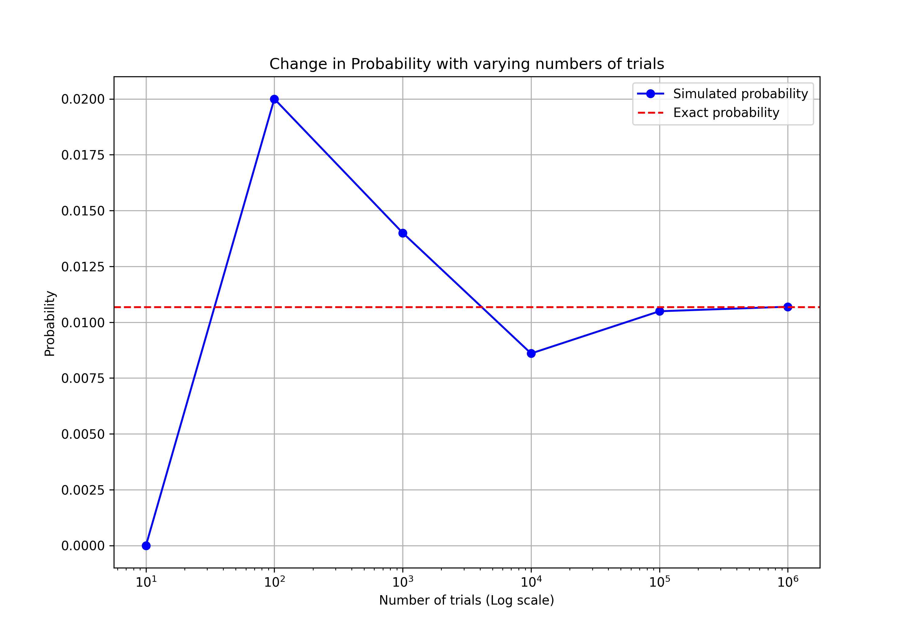

# Dice Probability Distribution Project

This project aims to determine the probability distribution of the aggregate values obtained from rolling five distinct Platonic solid dice. These dice are unique as each face is a regular polygon, and they have 4, 6, 8, 12, and 20 faces respectively.

## Game Rules:
Each player rolls five dice once per turn, one of each type: tetrahedron (4 faces), cube (6 faces), octahedron (8 faces), dodecahedron (12 faces), and icosahedron (20 faces). The aggregate value is the sum of the face values showing up after the roll, a win is registered if the sum is 10 or less, or 45 or more. The objective is to study the probability distribution of the aggregate values.

Utilizing the method of discrete convolution, an exact probability distribution was derived. Additionally, Monte Carlo simulations were implemented to verify the analytical results and compare them with the exact probability distribution. Lastly, the number of trials needed to keep the relative error below 10% was computed.

## Results

### Task 1: Probability Function

The probabilities tend to decrease as the sums deviate from the average sum, suggesting a distribution that is bell-shaped, with central values being more probable than the extreme ones, as can be seen below:

| **Sum (S)** | **Probability \(P(S = s)\)** |
|-------------|----------------------------|
| 5           | 2.2e-05                    |
| 6           | 1.1e-04                    |
| 7           | 3.3e-04                    |
| 8           | 7.6e-04                    |
| 9           | 1.5e-03                    |
| 10          | 2.6e-03                    |
| 11          | 4.2e-03                    |
| 12          | 6.3e-03                    |
| .           | .                          |
| .           | .                          |
| .           | .                          |
| 48          | 3.3e-04                    |
| 49          | 1.1e-04                    |
| 50          | 2.2e-05                    |

The bell-shaped curve is clearly visualised in the bar chart below, representing the probability distribution computed from the table above. It is obvious that the probability distribution is centered around a specific range of sums, with the probability decreasing as we move away from this central range in either direction. This highlights how the winning sums are less likely to occur as they are located at the tails of the distribution::

### Task 2: Winning Probability
The exact winning probability for these conditions is approximately 0.010677 or 1.0677%. It is low due to the winning sums which are less probable as they are in the extremes of the distribution. This is mainly because there are fewer combinations of dice rolls that can result in these extreme sums. For instance, achieving a sum of 5 is only possible if each of the five dice shows a 1 on its top-facing side, which is only one possible combination out of the many available when rolling five dice. In contrast, a sum like 25 has many possible combinations, e.g., [6, 6, 6, 4, 3], [5, 6, 6, 4, 4], and so on, making it more likely to occur.

### Task 3: Monte Carlo Simulation
A simulation with 1000 trials gave a winning probability of about `0.0150`. This result is very close with the analytical probability obtained in Task 2.

### Task 4: Simulation Precision
More trials generally mean more precise simulated probabilities, closer to actual values.

Expect small variations in the graph each time the simulation is run, due to the randomness in the Monte Carlo method. Different runs may result in slight differences, but usually, \(10^6\) trials give results that are nearly the same as the exact probabilities.

### Task 5: Required Trials for Accurate Simulation
Approximately 5000 trials are typically required to achieve a relative error below 10% between the simulated and exact probability. However, this is also not consistently the case due to the inherent randomness in simulations.